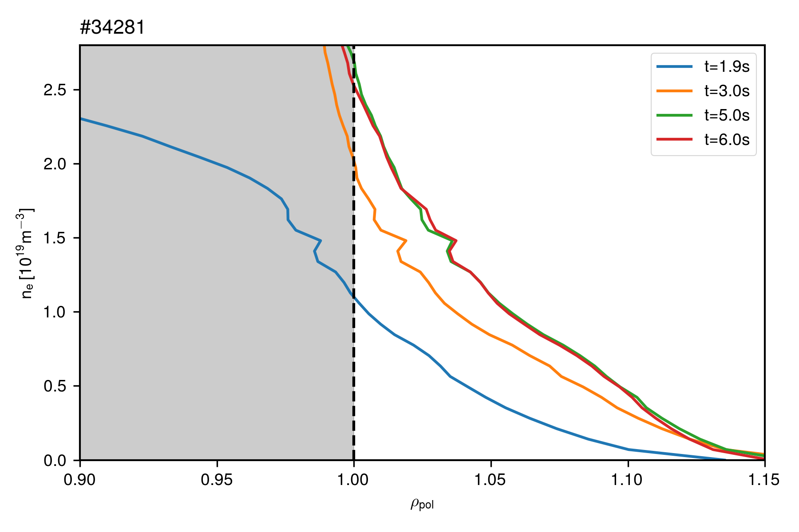

# Shoulder formation in DN and dependence on SP distance
---

## Motivation

The shoulder in the density profiles is related to detachment state of the outer divertor.

---

## Shotlist

The main proposal for these discharges is from MST1 2017, HLT21.
Some other discharges are added to complement the database.

| Shonumber | Observation | Ref | Fund |
|---|---|---|---|
| 30518 | Old shot with CD4 seeding | BB | IPP |
| 34874 | Small ELMs | BB | IPP |
| 34875 | Small ELMs __PROC+RDL Reproc__ | BB | IPP |
| 34877 | Small ELMs | BB | IPP |
| 34878 | Small ELMs __H1+PROC+RDL__ | BB | IPP |
| 34879 | SEs, no HFSLP data | BB | IPP |
| 34881 | Small ELMs | BB | IPP |
| 34882 | Small ELMs | BB | IPP |
| 34886 | Small ELMs | BB | IPP |
| 34962 | Small ELMs | BB | IPP |
| 35548 | Small ELMs | BB | MST1 |
| 35549 | Small ELMs | BB | MST1 |
| 35550 | Small ELMs | BB | MST1 |
| 35551 | Small ELMs | BB | MST1 |
| 35562 | Small ELMs | BB | MST1 |
| 35563 | Small ELMs | BB | MST1 |
| 35876 | NaN | BB | MST1 |
| 35877 | Shot for turbulence measurements | FF | MST1 |
| 35878 | Long close to DN period | BB | MST1 |
| 35879 | NaN | BB | MST1 |
| 35880 | NaN | BB | MST1 |
| 35881 | NaN | BB | MST1 |
| 35882 | NaN | BB | MST1 |
| 35883 | NaN | BB | MST1 |
| 35884 | NaN | BB | MST1 |
| 35893 | LH transition with higher fuelling | BB | MST1 |
| 35835 | HFSHD & ballooning | BB | IPP |
| 35836 | HFSHD & ballooning, N seed | BB | IPP |

---

## Langmuir probe data and magnetic configuration

The temperature profile at both targets seems to be also dependent on magnetic configuration.

At this point, I'm stumbled. This is the only good example I have seen so far.